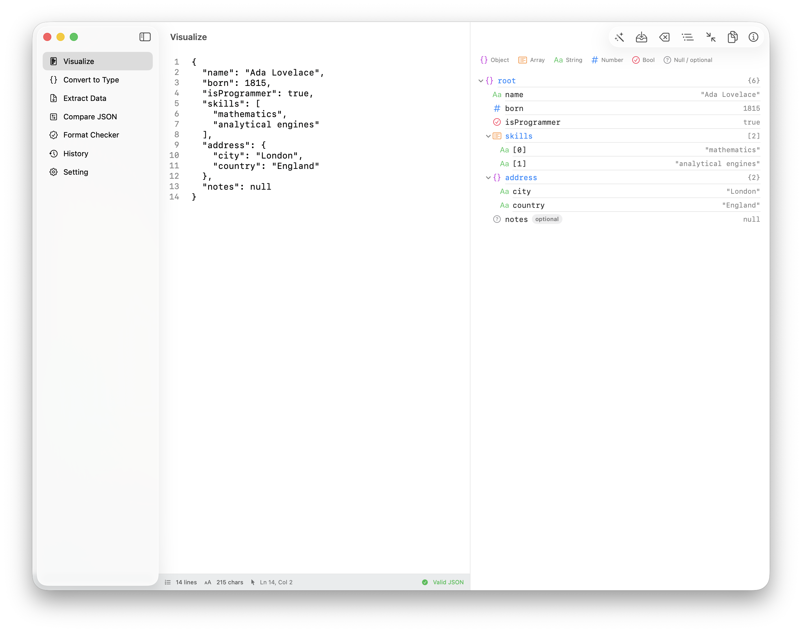
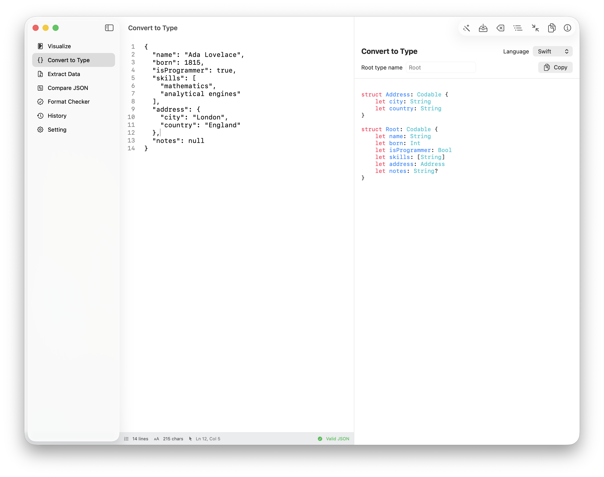

# JsonLens


A native macOS app for inspecting, validating, comparing, and turning JSON into type definitions.

JsonLens is built with **SwiftUI**, **AppKit**, and **SwiftData**. It includes a line-numbered JSON editor, a three-column navigation layout, JSON comparison, generated model code, and saved snippets.

## Download

Download the latest version from the **GitHub Releases** page.

➡️ **[Latest Release](releases/latest)**

## Installation

See **[INSTALLATION.md](INSTALLATION.md)** for installation instructions.

## Screenshots

### Visualize



### Convert to Type



---

## Features

- **Visualize** — inspect valid JSON and its structure.
- **Convert to Type** — generate model definitions from an object or an array of objects.
  - Swift
  - Go
  - TypeScript `type`
  - TypeScript `interface`
  - Python
- **Compare JSON** — compare the shared document on the left with a second JSON document on the right.
  - Highlights additions, removals, and changes.
  - Shows JSON paths, left/right values, and source line numbers.
- **Extract Data** — choose an array of JSON objects and its fields, preview the result as CSV, then copy it.
- **Format Checker** — reports JSON parsing errors with line and column information.
- **History** — saves JSON snippets locally with SwiftData.
- **Settings** — manages editor preferences and resets stored editor content.

## Editor workflow

The middle column contains the JSON editor. Use its toolbar to:

- Load the most recent saved snippet or a sample document.
- Save the current shared document to History.
- Clear, format, minify, or copy the shared document.
- View document statistics and validation status.

In **Compare JSON**, the shared app document is the left editor. This means edits you make in Visualize, Convert to Type, Format Checker, or Extract Data are immediately available on the left side of Compare.

> The Compare toolbar acts on the shared left document. Edit the right pane directly when preparing a comparison.

## Extract CSV

1. Paste valid JSON containing an array of objects, such as an array of users.
2. Open **Extract Data** in the sidebar.
3. Select the source array when more than one is available.
4. Toggle the columns to include, for example `username` and `dob`.
5. Choose a separator: comma, semicolon, tab, or pipe.
6. Review the preview and choose **Copy CSV**.

Cells containing the selected separator, quotes, or line breaks are escaped according to CSV conventions. Fields missing from a row become empty cells.

## Generated type preview

The type generator displays code in a selectable, monospaced preview with lightweight syntax coloring:

| Color | Meaning |
| --- | --- |
| Pink | Language keyword |
| Teal | Type name |
| Blue | Field/property name |
| Purple | Number literal |
| Orange | String literal |
| Secondary | Comment |

Each output language defines its own preview keywords in `JsonLens/Services/CodeGenerators/CodeGenerating.swift`. When adding a generator, add the matching `OutputLanguage` case, generator implementation, and keyword list in the same area.

## Requirements

- macOS **26.5** or later (the project deployment target)
- Xcode with macOS development tools installed

There are no third-party package dependencies.

## Run the app

### Xcode

1. Open `JsonLens.xcodeproj`.
2. Select the **JsonLens** scheme.
3. Choose **My Mac** as the run destination.
4. Press <kbd>⌘</kbd><kbd>R</kbd>.

### Command line

```sh
xcodebuild \
  -project JsonLens.xcodeproj \
  -scheme JsonLens \
  -configuration Debug \
  -destination 'platform=macOS' \
  build
```

## Tests

The project includes two styles of tests:

- `JsonLensTests` uses the modern **Swift Testing** framework for model, parser, generator, and service behavior.
- `JsonLensUITests` uses **XCTest UI testing** to exercise user-visible behavior.

Run all tests:

```sh
xcodebuild \
  -project JsonLens.xcodeproj \
  -scheme JsonLens \
  -configuration Debug \
  -destination 'platform=macOS' \
  test
```

Run only the unit tests:

```sh
xcodebuild \
  -project JsonLens.xcodeproj \
  -scheme JsonLens \
  -destination 'platform=macOS' \
  -only-testing:JsonLensTests \
  test
```

Run the focused type-generator UI test:

```sh
xcodebuild \
  -project JsonLens.xcodeproj \
  -scheme JsonLens \
  -destination 'platform=macOS' \
  -only-testing:JsonLensUITests/JsonLensUITests/testTypeGeneratorShowsGuidanceBeforeJSONIsEntered \
  test
```

## Project structure

```text
JsonLens/
├── App/                    # App entry point and NavigationSplitView
├── Models/                 # JSON values, snippets, and tool navigation models
├── Services/               # Parser, formatter, diffing, clipboard, generators
│   └── CodeGenerators/     # Per-language output generators and metadata
├── ViewModels/             # Observable app, editor, compare, and generator state
└── Views/
    ├── Content/            # JSON editor, history, and settings
    ├── Detail/             # Visualization, comparison, validation, generation
    └── Sidebar/            # Tool navigation

JsonLensTests/              # Swift Testing unit tests
JsonLensUITests/            # XCTest UI tests
```

## Architecture notes

- `AppViewModel` owns navigation state, the shared document, and the right Compare document.
- `JSONEditorViewModel` owns editor text, parse state, errors, statistics, formatting, and minifying.
- `JSONParser` is a hand-written parser that preserves object key order and reports exact parse locations.
- `TypeModelBuilder` infers fields and nested types; each `CodeGenerating` implementation renders that shared type model for one language.
- `CompareViewModel` uses `JSONDiffService` and parser-provided source lines to describe differences.

## Roadmap

Development is tracked through GitHub Issues.

### Planned

- [ ] Improve CSV export with nested object and array flattening
- [ ] Add new languages for code generation
- [ ] Improve JSON diff visualization
- [ ] Improve test coverage

See all planned features:
➡️ [Roadmap](issues?q=label%3Aroadmap)

## License

See [LICENSE](LICENSE).
